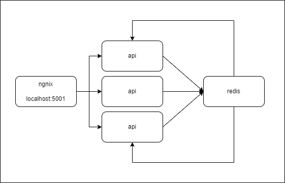

# Hybrid Caching

This project has been prepared to serve as an example of how the Hybrid Caching structure can be constructed using the "
EasyCaching" library.

The project could be executed via _docker-compose_ which is located at the main directory. When docker-compose file is
used, there will be 1 ngnix instance, 3 Api applications and 1 redis instance.

Step 1:
All Apps cache are empty. A request has been made to write the Key1 and the Value1 to Redis through App1.

|      |  Redis   |  App1 - Memory  |  App2 - Memory  |  App3 - Memory  |
|------|:--------:|:---------------:|:---------------:|:---------------:|
| Key1 |  Value1  |     Value1      |      null       |      null       |

Step 2:
"in-memory/keys/{key}/values" endpoint has been called from all app. App1 has the value in its memory, so it returns the Value1. App2 and App3 does not have the value in their memory, so they return null.

|      |  Redis   |  App1 - Memory  |  App2 - Memory  |  App3 - Memory  |
|------|:--------:|:---------------:|:---------------:|:---------------:|
| Key1 |  Value1  |     Value1      |      null       |      null       |

Step 3:
"keys/{key}/values" endpoint has been called from all app. App1 has the value in its memory, so it returns the Value1. App2 and App3 does not have the value in their memory, so they fetch the value from Redis and return the Value1. During this process, App2 and App3 also write the value to their memory.

|      |  Redis   |  App1 - Memory  | App2 - Memory | App3 - Memory |
|------|:--------:|:---------------:|:-------------:|:-------------:|
| Key1 |  Value1  |     Value1      |    Value1     |    Value1     |

Step 4:
A request has been made to update the value in Redis. Let this request be processed through App1. App1 will update the value in Redis and also update the value in its memory. App2 and App3 will be notified about that changes via Redis-Bus. By listening to Redis-Bus warnings, old values in the memory will be deleted. In this way, presenting stale data to the user will be prevented.

|      | Redis  | App1 - Memory | App2 - Memory | App3 - Memory |
|------|:------:|:-------------:|:-------------:|:-------------:|
| Key1 | Value2 |    Value2     |     null      |     null      |

